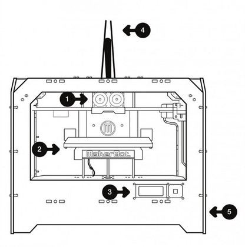

# Makerbot Replicator Dual


<details open markdown="block">
  <summary>
    Table of contents
  </summary>
  {: .text-delta }
1. TOC
{:toc}
</details>

## Overview

The MakerBot Replicator 1 is a dual extruder 3D printer with a heated build plate. This 3D printer uses plastic build materials like ABS and PLA. The Replicator 1 offers a layer height resolution of 0.2 mm - 0.3 mm, a positioning precision of 2.5 micron on Z axis and 11 micron on XY axis, and a maximum build envelope of 8.9 x 5.7 x 5.9 in.

The Replicator 1 does not consume `G-CODE`! Instead it uses `X3G` files (originally [`S3G`](https://github.com/makerbot/s3g/blob/master/doc/s3gProtocol.md)). Most modern slicing software, e.g. [Slic3r](https://slic3r.org/), [SuperSlicer](https://github.com/supermerill/SuperSlicer), [PrusaSlicer](https://www.prusa3d.com/prusaslicer/) or [Ultimaker Cura](https://ultimaker.com/software/ultimaker-cura) will take a `STL` file as input and create a `GCODE` file as output. This `GCODE` file will need to be converted into an `X3G` file (using the [**GPX**](https://github.com/markwal/GPX) application) in order for the Replicator to print your model.

3D models in `STL` format can be downloaded from Thingiverse, etc. Alternatively, a 3D model can be created in CAD programs like SolidWorks, Fusion360, or OpenSCAD and saved in `STL` format.

---

## Useful Links

* [Original MakerBot Replicator™ Page](https://web.archive.org/web/20130118060633/http://store.makerbot.com/replicator.html)
* [The Makerbot Replicator™ - Support](https://web.archive.org/web/20130126145337/http://www.makerbot.com/support/replicator)
* [Sailfish Firmware Documentation](http://www.sailfishfirmware.com/doc/toc.html#x2-1000)

---

## Specs

### Printing
* Build envelope: 225 x 145 x 150 mm / 8.9 x 5.7 x 5.9 in
* Layer thickness: Choose 0.2-0.3 mm with stock nozzle
* Stock nozzle diameter: 0.4 mm
* Speed: 40 mm/s
* Flow rate: approximately 24 cc/hr
* Extruder Temperature: Recommended Maximum 230 C
* Heated Build Platform: 120 C Maximum
* Positioning precision: 2.5 micron on Z axis / 11 micron on XY axes

### Electronics
* MakerBot MightyBoard single-piece motherboard
* 5 axis, 1/16 micro-stepping motor control
* 4x20 LCD character display and multi-directional control pad
* Piezoelectric buzzer
* Software-controllable RGB LED lighting
* Universal Power Supply: 100-240V, 50/60Hz, 4.0A (input), and takes standard IEC cable

### Software
* Print from SD card or over USB
* Input file type: X3G
* [Sailfish Firmware](http://www.sailfishfirmware.com/doc/sailfish.html)

### Materials
* Works with ABS, PLA, and other materials
* Filament diameter: 1.75 mm

### Mechanical
* Overall dimensions: 320 x 467 x 381 milimeters / 12.6 x 18.4 x 15 in
* Shipping weight: 32lbs
* Linear ball bearings
* Precision ground 8 mm shafts
* Snap-on, snap-off carriage assemblies

### NEMA 17 Hybrid Stepper Motor
* Manufacturer: Moons Motors
* 200 steps per revolution (1.8 deg/step)
* 2 Phase
* Rated Voltage 4.83V DC
* Rated Current 0.84A
* Phase Resistance: 5.75 Ohm ± 10% (20º C)
* Phase inductance: 9.3mH ± 20% (1kHz 1 V rms)
* Holding torque: 0.28N.m Min.
* Shaft diameter: 5mm / 0.188" (3/16")
* Shaft length: 20mm
* Motor depth: 34mm

---

## Design Files

The Makerbot Replicator 1 was open source:

* [The MakerBot Replicator](https://www.thingiverse.com/thing:18813)
* [MakerBot Replicator Interface Board REVB](https://www.thingiverse.com/thing:16067)
* [MakerBot Replicator Heater Board REVB](https://www.thingiverse.com/thing:16061)
* [MakerBot MightyBoard RevE](https://www.thingiverse.com/thing:16058)
* [MakerBot BotStep17 REVE](https://www.thingiverse.com/thing:16059)

## Clones

As the original Makerbot Replicator 1 design files were public domain, the printer had many clones. Parts for the clones can usually be substituted:

* Wanhao Duplicator 4S
* FlashForge Creator Dual
* Monoprice Architect 
* CTC Dual / Bizer
* Tangibot

---

## The Replicator™ Diagram

Before we continue, let’s familiarize ourselves with some of the main features of The MakerBot Replicator.



1. Stepstruder MK8 (attached to mount)
2. Build Platform
3. LCD Interface Panel
4. Guide tubes
5. SD Card slot (on side panel)


1. Power switch
2. Power input
3. USB input
4. Reset switch
5. Spool holders

---

## Using the Replicator

> Regarding dual extrusion, i.e. printing in 2 colors - just don't! The dual extruders are convenient to keep 2 different filaments loaded, but use only one at a time. Ideally you want to remove the nozzle not in use to avoid knocking print jobs of the bed.

### Review the Sailfish firmware documentation

* [Front Panel Operation](http://www.sailfishfirmware.com/doc/ui.html#x11-100003)
* [Leveling the Build Plate](http://www.sailfishfirmware.com/doc/basic-usage-leveling.html#x6-50002.1)

### Menu Navigation

> Most menu options don't need to be touched, refer to [Front Panel Operation](http://www.sailfishfirmware.com/doc/ui.html#x11-100003) for more info. When you see this :warning: an option can render the printer inoperable!

Here are some of the commonly used menu options:

* Print from SD - Browse and select files to print from the SD card
* Preheat
    * Start Preheating - heat your printer based on the selections below without starting to print
    * Right Extruder [ON/OFF]
    * Left Extruder [ON/OFF]
    * Platform [ON/OFF]
* Utilities
    * Monitor Mode - current temperatures of heating elements, if enabled also target temperatures
    * Filament Loading - load, unload and change filament in any extruder
        * Unload right
        * Load right
        * Unload left
        * Load left
    * Preheat Settings - set the preheat temperatures for each of the heating elements
        * Right Extruder [220]
        * Left Extruder [220]
        * Platform [50]
    * General Settings - :warning:
    * Level Build Plate - set up printer to level build plate
    * Home Axes - utility to home the axes, first X and Y, and then Z
    * Bot Statistics - displays usage information printer
    * Filamanent Odometer - display lifetime filament usage in meters
    * Profiles - save up to four preheat and home offsets settings, and quickly recall them
        * ABS
        * PLA
        * Profile3
        * Profile4
    * Home Offsets - :warning: change the home offsets, which define the center of the build plate (0,0,0) relative to the endstops
    * Toolhead Offsets - :warning: change the X and Y toolhead offsets which describe the spacing between the two extruder nozzles
    * Jog Mode - move the extruder and build plate
    * En/Disable Steppers - change the status of all stepper motors
    * Calibrate Nozzles - :warning: enter nozzle calibration indices after calibration print
    * Restore Settings - :warning: restore all factory settings save for the home offsets and toolhead offsets
    * Eeprom - :warning: EEPROM utilities
    * Version Information - printer version information

### Bed Levelling

* Before starting, it's a good idea to lower the build plate by turning in (clockwise) all 4 bed asjustment screws underneath the build plate a few turns. This ensures the extruder nozzle will clear the build plate.
* Pre-heat the build plate by selecting **Preheat**. Only the **Platform** needs to be set to [ON]
* Allow the build plate 10+ minutes to heat soak
* Select **Utilities** -> **Level Build Plate**
* Printer will home the axes, first X and Y, and then Z
* Once homed, the extruder will be moved to the center of the build plate
* Move the extruder nozzle roughly over the right-rear adjustment screw
* Use a sheet of printer paper (roughly 0.1mm thick) and adjust the screw until you feel *slight* resistance when sliding the paper between the nozzle and the build plate. If the plate doesn't move, give the other 3 screw 1/2 a turn out (counter-clockwise) and try again.
* Repeat this process in the rear-left, then front-left and finally front-right positions
* Repeat all 4 positions to confirm you get the same amount of drag everywhere
* Once satisfied, push the controller button a few times to end leveling mode

> If your platform is too low, your prints might not stick to the surface, and if it's too high, the nozzles could damage the platform surface.

### Loading Filament

* Remove the filament guide tube from the top of the extruder. Make sure to hold down the gray ring that connects the tube to the Stepstruder -- just pulling on the tube won’t work.
* Make sure there is no filament in the extruder, otherwise remove it first.
* Place a roll of filament on the spool holder with the filament feeding from the bottom. Feed the filament into the guide tubes from the back until you see it come out at the front.
* Select **Utilities** -> **Filament Loading** -> **Load Left/Right**
* The extruder will heat up to the temperature set up in **Utilities** -> **Preheat Settings** -> **Left/Right Extruder**
* Once the nozzle is at temperature, the printer will beep and start feeding. Push the lever on the extruder down and insert the filament as far down as it will go. Release the lever. The filament should start feeding into the extruder. If not, push the lever and pull the filament out slightly.
* Once the filament starts being extruded through the nozzle, klet it run for 30-60 sec to purge the extruder.
* Push the center button on the controller to stop the process.

### Unloading Filament

* Remove the filament guide tube from the top of the extruder. Make sure to hold down the gray ring that connects the tube to the Stepstruder -- just pulling on the tube won’t work.
* Select **Utilities** -> **Filament Loading** -> **Unload Left/Right**
* The extruder will heat up to the temperature set up in **Utilities** -> **Preheat Settings** -> **Left/Right Extruder**
* Once the nozzle is at temperature, the printer will beep and start running. Push the lever on the extruder down and pull the filament out of the extruder.
* Push the center button on the controller to stop the process.

### Setting up your Slicer

> I recommend using [SuperSlicer](https://github.com/supermerill/SuperSlicer).

* An initial configuration bundle can be downloaded [SuperSlicer_config_bundle.ini](./download/SuperSlicer_config_bundle.ini)
* In SuperSlicer go to **File** -> **Import** -> **Import Config Bundle...** to import the bundle
* You may need to adjust filament extrusion temperatures based on your filament
* Adjust print settings like infill etc and slice!
* Click the **Slice Now** button to slice the model according to your settings
* Click the **Export G-code** button to save a g-code file, or click the **G** button right next to it to send the g-code file directly to Octoprint as defined in the **Physical Printer** settings in SuperSlicer. 

### Preparation
1. Power on Replicator
1. Level bed (if it hasn't been done recently)
1. Load filament
1. Prime filament

### Steps
1. Design/Download STL file
1. Slice STL file into G-CODE file with the slicer

#### Using SD card
1. Convert G-CODE file to X3G file using GPX
1. Save X3G file onto SD card and insert into Replicator
1. Select file using the control pad and LCD display
1. Print!

### OR

#### Using OctoPrint
1. Power on the Raspberry Pi
1. Access the OctoPrint UI on a web browser
1. Connect OctoPrint to the Replicator
1. Upload G-CODE file from Octoprint or send it directly to OctoPrint from your slicer
1. GPX plugin in Octoprint will automatically convert G-CODE to X3G
1. Select file on the Octoprint UI in a web browser
1. Print while watching progress remotely with the webcam!

> It is recommended that the extruder warm up at printing temperature for a good 5-10 minutes before attempting a first noodle when starting from cold. After it's warmed up, some prefer to "idle" at about 160C between builds. It's cold enough that the nozzle doesn't ooze and you're less likely to get a rising pool of molten ABS in the barrel.

---

## Maintenance

* [The Makerbot Replicator™ - Support](https://web.archive.org/web/20130126145337/http://www.makerbot.com/support/replicator)
* [Original MakerBot REPLICATOR 1 REPAIR PARTS & ACCESSORIES Page](https://web.archive.org/web/20130118060753/http://store.makerbot.com/parts-accessories/replicator-1-repair-parts-accessories.html)
* [The Replicator Maintenance](https://www.youtube.com/watch?v=HA5TvWp5YJ8) [YouTube]

### Lubrication

Use a very light coat of PTFE grease on the 6 precision rods, threaded Z-axis rod and the X-axis idler pulleys.

### Heater cartridges

24V 40-45W cartridge to fit a ¼ inch (6.35 mm) diameter hole. The diameter of a cartridge will be around 0.247 inches (6.27 mm) with a tolerance of plus or minus .002 inches (0.05 mm). The approximate wire length needed from control board to mounted cartridge is 51 inches (1.3m). Heater cartridge lead lengths are shorter than that so extension leads will need to be spliced. Ensure that the cartridges are 24V.  They will have a resistances of 13-15 Ohms across the wires.

### Thermocouples

K-Type thermocouple

### Replacing Extruder Nozzles

* [REPLACING YOUR MK8 NOZZLE](https://web.archive.org/web/20121205043439/http://www.makerbot.com/support/replicator/troubleshooting/nozzle-swap/)

> Use 0.4mm MK8 nozzles. Never try to replace a nozzle cold! Always do a preheat and remove the nozzle hot. Trying to remove it cold is a guaranteed way to shear one off!

The nozzles on dual-extruder Replicators are adjusted at our factory to be within 0.3 mm of each other's heights, but if you want to fine-tune them, click [here](https://web.archive.org/web/20121201020214/http://www.makerbot.com/support/replicator/troubleshooting/support/replicator/troubleshooting/nozzle-shim) to learn how to use a Kapton tape shim to raise one side of the Stepstruder.


### Changing the WiFi on the Raspberry Pi (OctoPrint)


Remove the SD card, plug it into another Linux computer like e.g., the Raspberry Pi and enter in Terminal:
Use an Ethernet cable to connect your Pi with your router directly.

In order to change the WiFi settings on the Raspberry Pi, you will need to connect to edit and edit the WiFi settings file.

#### Connect a HDMI monitor and USB keyboard to access the Linux console

* Enter login credentials, default `pi` and `raspberry`

* Edit the WiFi settings file

```bash
sudo nano /etc/wpa_supplicant/wpa_supplicant.conf
```

* Change the WiFi settings

```
network={
   ssid="Test Wifi Network"
   psk="SecretPassWord"
}
```

#### Connect an ethernet cable between your computer and the Raspberry Pi, then use a terminal emulator to connect

* Once the cable has been connected, open your terminal emulator
* Connect to the raspberry pi

```bash
ssh pi@octopi.local
```

* Enter your password, then proceed as shown above

#### Remove the microSD card from the Raspberry Pi and insert in your computer

The `wpa_supplicant.conf` should be in the `/boot` folder on the SD card

