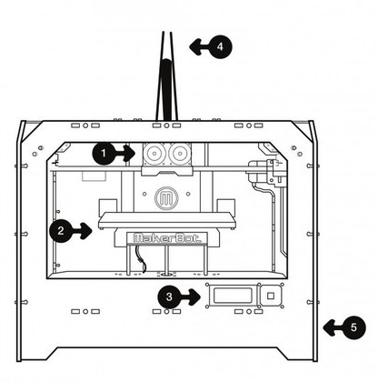
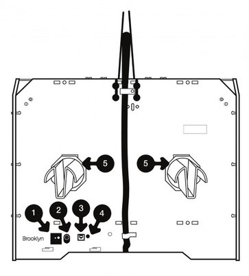

# {{ page.title }}

  

    Table of contents
  

  {: .text-delta }
- TOC
{:toc}

The MakerBot Replicator 1 is a dual extruder 3D printer with a heated build plate. This 3D printer uses plastic build materials like ABS and PLA. The Replicator 1 offers a layer height resolution of 0.2 mm - 0.3 mm, a positioning precision of 2.5 micron on Z axis and 11 micron on XY axis, and a maximum build envelope of 8.9 x 5.7 x 5.9 in.

The Replicator 1 does not consume `G-CODE`! Instead it uses `X3G` files (originally [`S3G`](https://github.com/makerbot/s3g/blob/master/doc/s3gProtocol.md)). Most modern slicing software, e.g. [Slic3r](https://slic3r.org/), [SuperSlicer](https://github.com/supermerill/SuperSlicer), [PrusaSlicer](https://www.prusa3d.com/prusaslicer/) or [Ultimaker Cura](https://ultimaker.com/software/ultimaker-cura) will take a `STL` file as input and create a `GCODE` file as output. This `GCODE` file will need to be converted into an `X3G` file (using the [**GPX**](https://github.com/markwal/GPX) application) in order for the Replicator to print your model.

3D models in `STL` format can be downloaded from Thingiverse, etc. Alternatively, a 3D model can be created in CAD programs like SolidWorks, Fusion360, or OpenSCAD and saved in `STL` format.

---

## Useful Links

* [Original MakerBot Replicator™ Page](https://web.archive.org/web/20130118060633/http://store.makerbot.com/replicator.html)
* [The Makerbot Replicator™ - Support](https://web.archive.org/web/20130126145337/http://www.makerbot.com/support/replicator)
* [Sailfish Firmware Documentation](http://www.sailfishfirmware.com/doc/toc.html#x2-1000)

---

## Specs

### Printing
* **Build envelope**: 225 x 145 x 150 mm / 8.9 x 5.7 x 5.9 in
* **Layer thickness**: Choose 0.2-0.3 mm with stock nozzle
* **Stock nozzle diameter**: 0.4 mm
* **Speed**: 40 mm/s
* **Flow rate**: approximately 24 cc/hr
* **Extruder Temperature**: Recommended Maximum 230 C
* **Heated Build Platform**: 120 C Maximum
* **Positioning precision**: 2.5 micron on Z axis / 11 micron on XY axes

### Electronics
* MakerBot MightyBoard single-piece motherboard
* 5 axis, 1/16 micro-stepping motor control
* 4x20 LCD character display and multi-directional control pad
* Piezoelectric buzzer
* Software-controllable RGB LED lighting
* **Universal Power Supply**: 100-240V, 50/60Hz, 4.0A (input), and takes standard IEC cable

### Software
* Print from SD card or over USB
* **Input file type**: X3G
* **Firmware:**: [Sailfish](http://www.sailfishfirmware.com/doc/sailfish.html)

### Materials
* Works with ABS, PLA, and other materials
* **Filament diameter**: 1.75 mm

### Mechanical
* **Overall dimensions**: 320 x 467 x 381 milimeters / 12.6 x 18.4 x 15 in
* **Shipping weight**: 32lbs
* Linear ball bearings
* Precision ground 8 mm shafts
* Snap-on, snap-off carriage assemblies

### NEMA 17 Hybrid Stepper Motor
* **Manufacturer**: Moons Motors
* 200 steps per revolution (1.8 deg/step)
* 2 Phase
* Rated Voltage 4.83V DC
* Rated Current 0.84A
* **Phase Resistance**: 5.75 Ohm ± 10% (20º C)
* **Phase inductance**: 9.3mH ± 20% (1kHz 1 V rms)
* **Holding torque**: 0.28N.m Min.
* **Shaft diameter**: 5mm / 0.188" (3/16")
* **Shaft length**: 20mm
* **Motor depth**: 34mm

---

## Clones

As the original Makerbot Replicator 1 design files were public domain, the printer had many clones. Parts for the clones can usually be substituted:

* Wanhao Duplicator 4S
* FlashForge Creator Dual
* Monoprice Architect 
* CTC Dual / Bizer
* Tangibot

---

## The Replicator™ Diagram

Before we continue, let’s familiarize ourselves with some of the main features of The MakerBot Replicator.

1. Stepstruder MK8 (attached to mount)
2. Build Platform
3. LCD Interface Panel
4. Guide tubes
5. SD Card slot (on side panel)

1. Power switch
2. Power input
3. USB input
4. Reset switch
5. Spool holders
