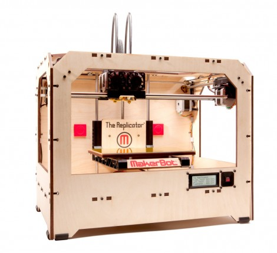

# {{ page.title }}

The MakerBot Replicator 1 is a dual extruder 3D printer with a heated build plate. This 3D printer uses plastic build materials like ABS and PLA. The Replicator 1 offers a layer height resolution of 0.2 mm - 0.3 mm, a positioning precision of 2.5 micron on Z axis and 11 micron on XY axis, and a maximum build envelope of 8.9 x 5.7 x 5.9 in.

This guide is a compilation of information found over the years while owning and operating the printer, which will hopefully help you keep your classic printer alive:

